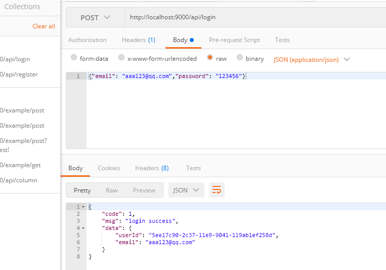
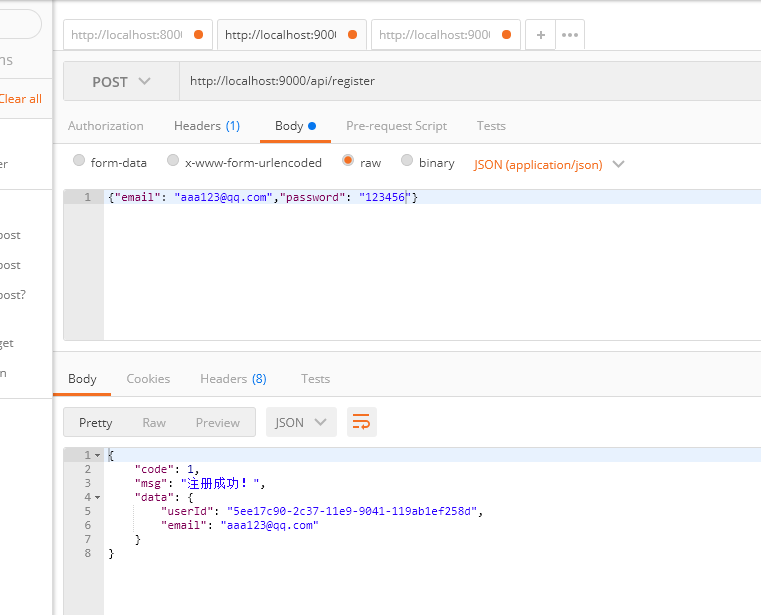

## 前言
这个项目是仿手机网易网NUXT版的后台，这里不使用koa-generator脚手架，我们直接自己搭建项目，适用于前后端分离。相信本项目对于想要入门写nodejs的朋友来说，一定会有所收获。

## 技术栈
Node + Koa + MongoDB

## 第三方库说明
这里理列一下在项目中使用的第三方库：
```javascript
// ...
"dependencies": {
  // 支持import模块引入
  "babel-plugin-transform-es2015-modules-commonjs": "^6.26.2",
  "babel-register": "^6.26.0",
  // 加密用户密码（数据库没有存明文密码）
  "bcrypt": "^3.0.0",
  // 解析前端请求参数
  "koa-bodyparser": "^4.2.1",
  // 路由
  "koa-router": "^7.4.0",
  // 解决跨域
  "koa2-cors": "^2.0.6",
  // 操作 mongoDB 数据库
  "mongoose": "^5.4.5",
  // 热重启
  "nodemon": "^1.18.9",
  // 生成唯一 id
  "uuid": "^3.3.2"
}
// ...
```

## 数据库
这里数据库用的是MongoDB，可视化工具用的是Robo 3T。
从我数据库中导出的 json 文件都在db-news-wy文件夹下面，
在Windows的终端中可以使用以下命令导入：
```
mongoimport -d 数据库名 -c 集合名 --file 文件路径 --type 文件类型
```
eg: 将news.json文件以json的形式导入news数据库的news集合中
```
mongoimport -d news -c news --file news.json --type json
```
MongoDB导出Collection命令：
```
mongoexport -d 数据库名 -c 集合名 -o 文件路径 --type 文件类型
```
eg: 将数据库news下的news集合以json文件的形式导出到E:\news.json
```
mongoexport -d news -c news -o  E:\news.json --type json
```
用户表是长这个样子的：
``` javascript
const mongoose = require('mongoose')

const Schema = mongoose.Schema
const UserSchema = new Schema({
  userId: {
    type: String,
    unique: true,
    require: true
  },
  email: {
    type: String
  }
}, { collection: 'user', versionKey: false })

module.exports = mongoose.model('user', UserSchema)

```
因为表比较多，全部都放出来比较占地方，其它的表在项目的`models`文件夹下面。

## 热重启的处理
我们每次修改都要关闭程序，然后再npm start，这给我们开发项目带来很多的不便，这时候就要用到nodemon(nodemon是一个实用程序，用于监视源中的任何更改并自动重新启动服务器)，它还支持自定义配置nodemon.json这里不做配置，直接使用。
```
npm install nodemon --save
```
修改package.json
``` javascript
"scripts": {
  "test": "echo \"Error: no test specified\" && exit 1",
  "start": "nodemon app.js"
}
```
运行npm start，这样就达到了热重启的效果了，可以愉快的开发了。

## 支持import模块的引入
目前原生的node是不支持import引入模块的，如果要在此项目中使用ES6的模块引入方式就要使用babel编译。
这时候我们安装以下依赖：
```
npm install babel-plugin-transform-es2015-modules-commonjs babel-register --save
```
在根目录下创建start.js
``` javascript
require('babel-register')
(
  {
    plugins: ['babel-plugin-transform-es2015-modules-commonjs'],
  }
)

module.exports = require('./app.js')
```
再修改下package.json
``` json
"scripts": {
  "test": "echo \"Error: no test specified\" && exit 1",
  "start": "nodemon start.js"
}
```
然后，你会发现我们的项目支持ES6的模块引入方式了，这样可以统一前后端的模块引入风格。

## 解决跨域
我们开发完接口后，在提供给前端调用的时候，肯定会出现跨域的问题。解决跨域的方式有很多，但这不是我们现在讨论的重点，这里我使用`koa2-cors`来处理：
```
npm install koa2-cors --save
```
将其作为中间件使用，在`app.js`中添加：
``` javascript
app.use(cors({
  exposeHeaders: ['WWW-Authenticate', 'Server-Authorization', 'Date'],
  maxAge: 100,
  credentials: true,
  allowMethods: ['GET', 'POST', 'OPTIONS'],
  allowHeaders: ['Content-Type', 'Authorization', 'Accept', 'X-Custom-Header', 'anonymous']
}));
app.use(bodyParser())
```
这里要注意一下，js 是单线程语言，中间件是有执行先后顺序的，所以`app.use(cors());`的使用必须在`router`之前，不然就无法解决跨域的问题哦！

## 接口测试
接口测试的工具本人用的是 Postman，这里只展示登录和注册的接口测试结果。

### 登录接口


### 注册接口


## 启动方法
```
npm install

npm start
```

## 源码目录介绍
```
│  app.js                           // 项目入口
│  config.js                        // 基础配置信息
│  start.js                         // 支持import引入模块配置
│  
├─controllers                       // 控制器目录
│      columns_controller.js        // 栏目控制器
│      exclusive_controller.js      // 原创页控制器
│      news_controller.js           // 首页控制器
│      recommend_controller.js      // 推荐页控制器
│      tabs_controller.js           // 分类控制器
│      user_controller.js           // 用户页控制器
│      
├─db-news-wy                        // 数据库导出的 json 文件（没地方放就放这了）
│      
├─models                            // 表目录
│      columns.js                   // 栏目表
│      exclusive.js                 // 原创新闻表
│      news.js                      // 首页新闻表
│      password.js                  // 用户密码表
│      recommend.js                 // 推荐新闻表
│      tabs.js                      // 分类表
│      user.js                      // 用户表
│      
├─routes                            // 路由目录
│      columns_router.js            // 栏目相关路由
│      exclusive_router.js          // 原创页相关路由
│      news_router.js               // 首页相关路由
│      recommend_router.js          // 推荐页相关路由
│      tabs_router.js               // 分类相关路由
│      user_router.js               // 用户相关路由
│      
└─utils                             // 工具库
        passport.js                 // 用户密码加密和验证工具
```
